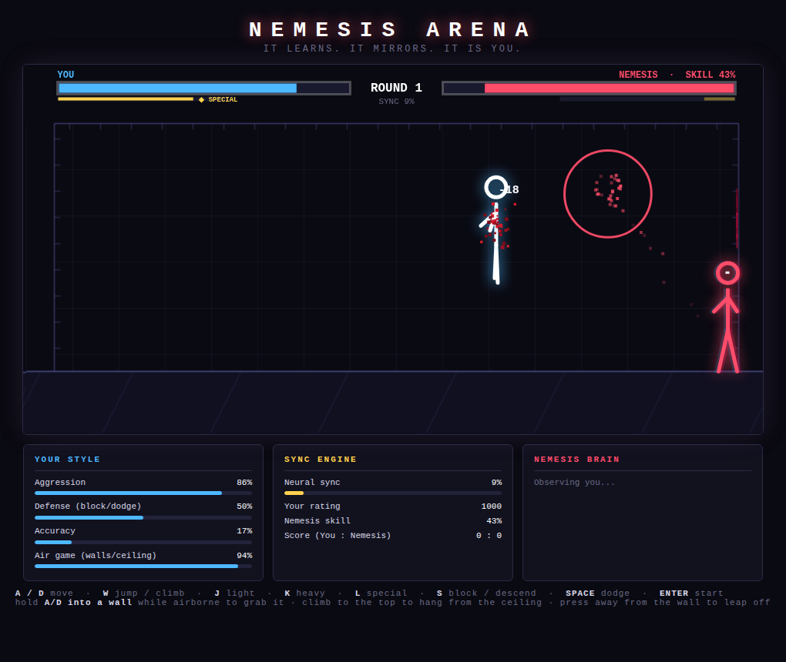
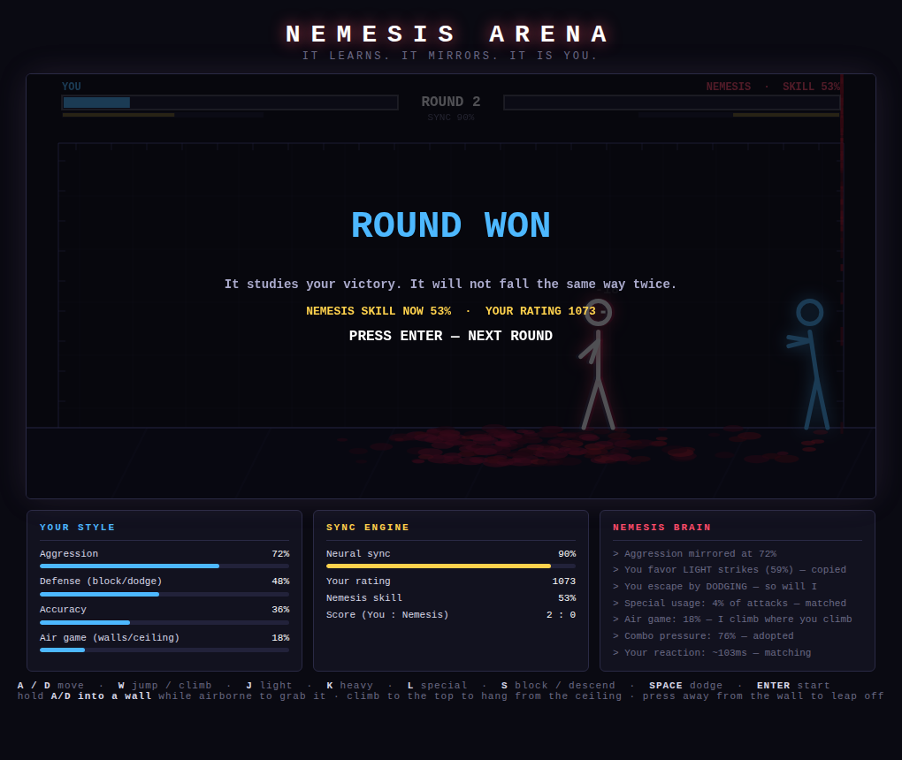

# ⚔️ NEMESIS ARENA

A tiny browser fighting game with one twist: **your opponent learns to fight like you, at exactly your skill level.**

No install, no build — open `index.html` in a browser and press **ENTER**.

## The Nemesis

The AI opponent is not scripted. It builds a live profile of *you*:

| It watches | It mirrors |
|---|---|
| How often you attack vs defend | Its own aggression |
| Light vs heavy attack preference | Its strike selection |
| How often you fire your special | Its special usage |
| Time you spend on walls / in the air | Its climbing & jumping |
| Whether you press after landing a hit | Its combo pressure |
| Whether you block or dodge under pressure | Its escape habits |
| The distance you like to attack from | Its spacing |
| How fast you react to its windups | Its reaction time |

On top of the style mirror sits a **sync engine** — an ELO-style rating that
tracks your performance every round and tunes the Nemesis' reaction speed,
mistake rate and decision quality so the expected outcome of every round is
always ~50/50. Win and it sharpens. Lose and it eases off. The fight stays
*interesting forever*.

It also **remembers you between sessions** (localStorage) — close the tab,
come back tomorrow, and your nemesis is still your nemesis.

## Controls

| Key | Action |
|---|---|
| `A` / `D` | Move |
| `W` | Jump / climb up a wall |
| `J` | Light attack (fast, weak) |
| `K` | Heavy attack (slow, strong, hurts through block) |
| `L` | **Special** — charged energy bolt, aimed at the enemy (needs a full ◆ meter) |
| `S` (hold) | Block on the ground / slide down a wall / drop from the ceiling |
| `SPACE` | Dodge (invincibility frames) |
| `ENTER` | Start / next round |

## Arena traversal

The whole cage is playable. Hold `A`/`D` **into a wall while airborne** to grab
it, climb with `W`, and keep climbing past the top to **hang from the ceiling**
and stalk sideways above the fight. Press away from a wall to leap off with a
wall-jump. The Nemesis learns how much air time you take — camp the ceiling and
it will climb after you or snipe you off it with its special.

## Specials, combos & blood

- **Special attack** — both fighters carry an energy meter (builds over time,
  faster when landing or taking hits). At full charge, `L` fires a glowing
  bolt aimed at the enemy from anywhere — ground, wall, or ceiling. Blockable
  for half damage, dodgeable outright.
- **Combos** — consecutive clean hits chain: damage scales up, hit counters
  flash, shockwave rings burst on big chains, and a 5-hit chain triggers
  **SAVAGE** slow-motion. The Nemesis copies how hard you press after a hit.
- **Blood** — hits spray blood that splatters and stays: pools on the floor,
  drips down the walls. You bleed red; the Nemesis bleeds dark ichor.

## How the adaptation works

1. **Profile** (`PlayerProfile`) — every input you make updates running
   statistics: attack counts, block/dodge counts, accuracy, an EMA of your
   attack spacing and your measured reaction time to enemy windups.
2. **Mirror** (`NemesisAI`) — the AI samples its actions from *your*
   distributions: it defends as often as you defend, dodges vs blocks in your
   ratio, throws heavies as often as you do, and fights at your favorite range.
3. **Skill match** (`SyncEngine`) — your rating moves after every round based
   on win/loss and health margin. The rating maps to the Nemesis' reaction
   delay (420ms → 130ms) and mistake rate (38% → 6%). A gentle in-round rubber
   band keeps individual rounds close without feeling scripted.

The HUD shows everything live: your style profile, the neural **SYNC** level,
your rating, and — between rounds — a log of what the Nemesis just learned
about you.
